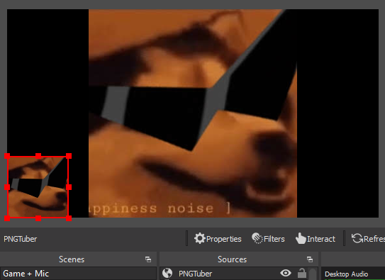

# PNGTubie
Become a PNGTuber without using Discord. Runs in OBS, based on mic activity level.
## Usage
For this to work as an OBS overlay you must add `--enable-media-stream` to your OBS args, as per [this thread](https://obsproject.com/forum/threads/browser-source-doesnt-allow-microphone-consent-dialogs.80260/). Then you can add the overlay, using your png width and height BUT adding 400 to the height. Then place your overlay so that the extra hight is below the frame, hiding the config menu which you will use to select your images and volume level. To show the "Interact" button you must have the overlay highlighted in your sources.

If you first use your image's exact resolution, you can snap the overlay to the corner, then add 400 to the height, and the image will stay perfectly aligned.
