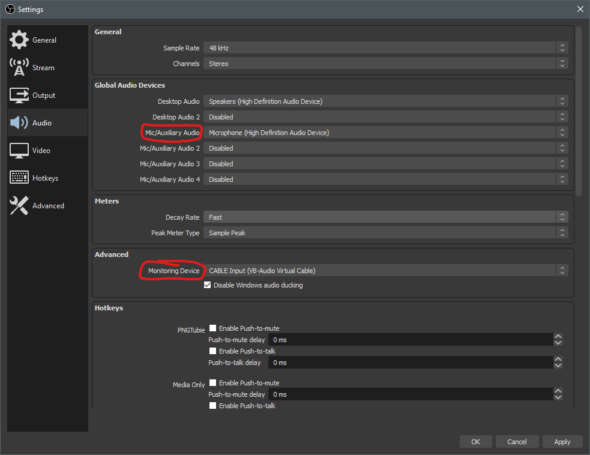
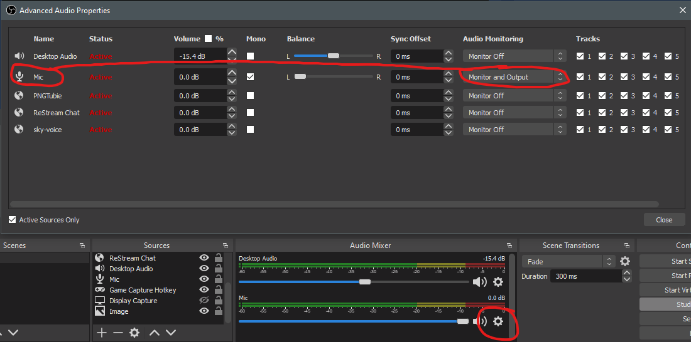
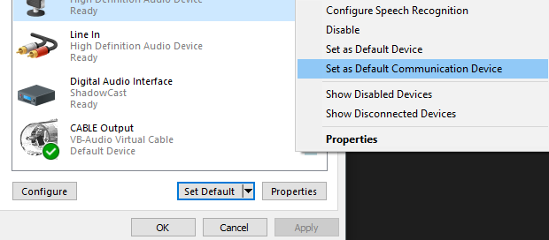

# Use OBS audio for Overlay via Virtal Audio Cable
My mic, like many, has a ton of static. It's actually caused by my motherboard but regardless I have to deal with it. In obs I have a noise gate and filter so that the viewers don't hear it, but the overlay will always use the default microphone directly. Well it just so happens that windows also has a default communication microphone in addition to the normal default. Most applications like discord actually use the communication device, so we can take advantage of this to get the overlay to use filtered mic audio.
## Install Virtual Audio Cable
Make sure to reboot right after the install. You can download this program for free [here](https://vb-audio.com/Cable/) or install it with chocolatey: `choco install vb-cable`
## Configure OBS
In obs studio, under Settings > Audio > Advanced, set Monitoring Device to `CABLE Input` and change your Mic to the appropriate device like so:

Then click the gear next to the volume slider for your microphone, select Advanced Audio Properties, and set your microphone to Monitor and Output

## Set Default Devices
The last step is to set CABLE Output as your default mic and your real mic as your default communications mic
